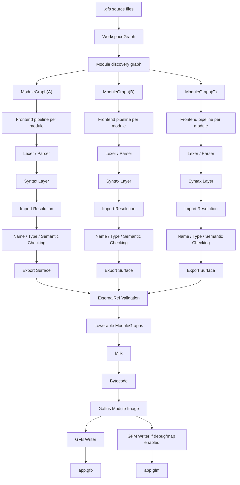
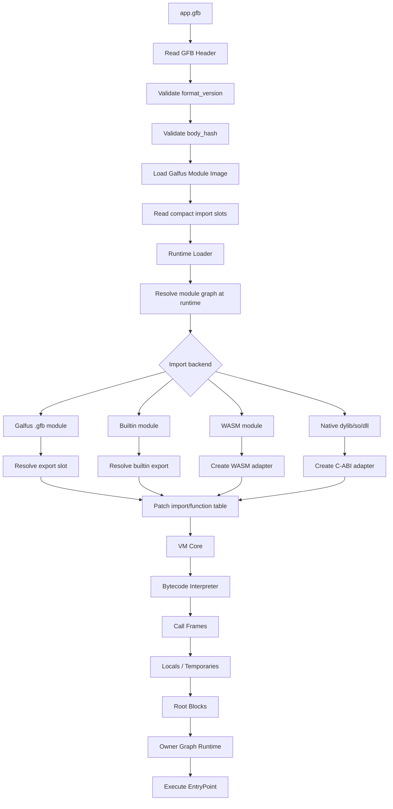
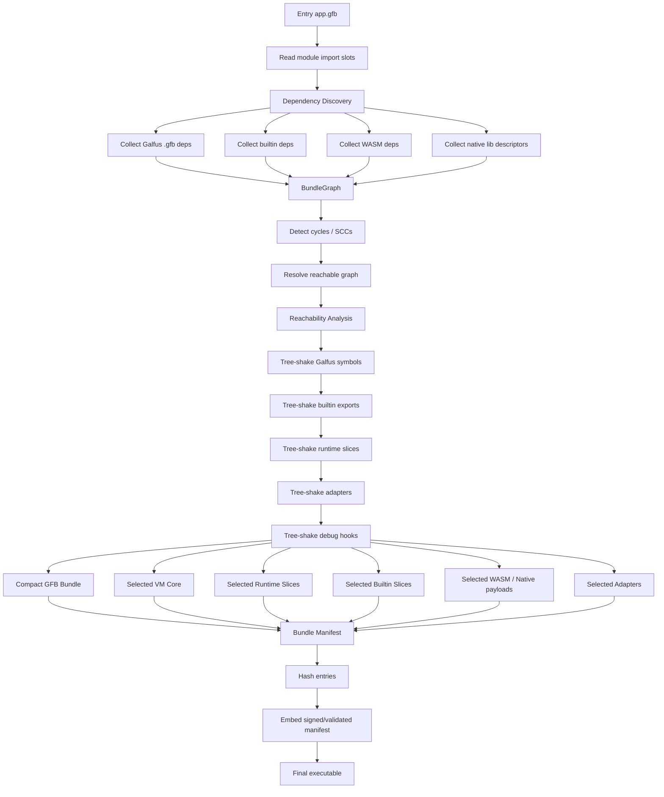
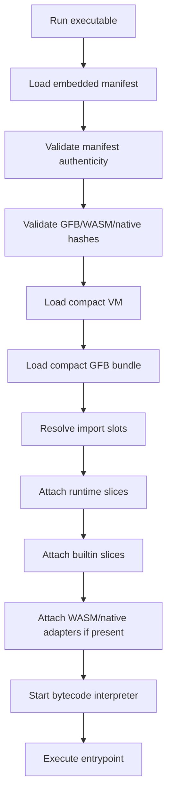
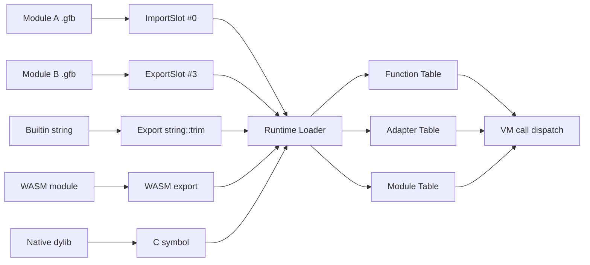
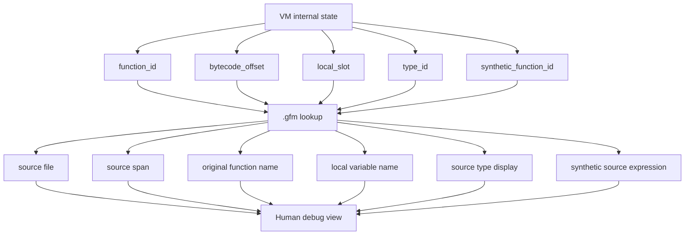
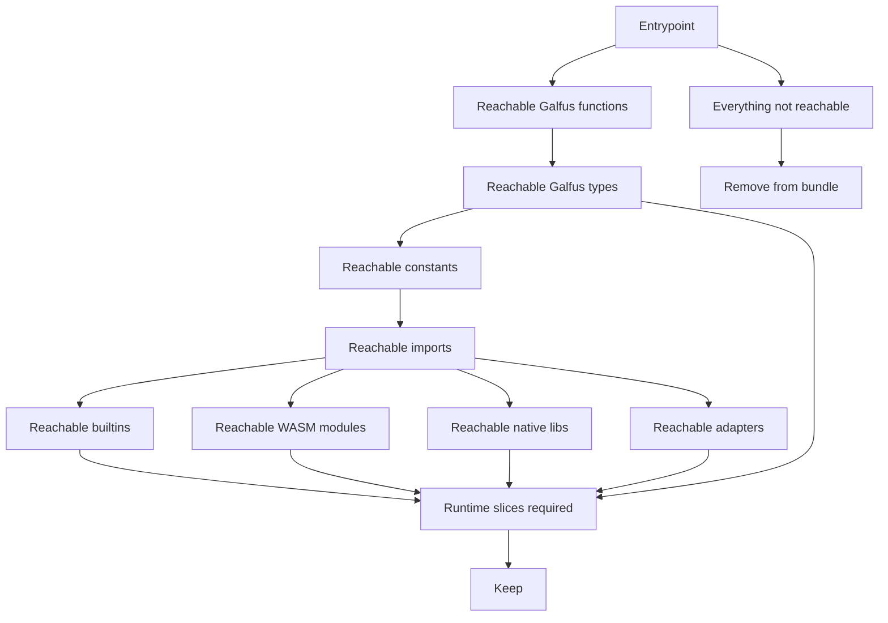

# Galfus Script - Base Architecture

## Table of Contents

1. [Identity](#1-identity)
2. [Architecture Scope](#2-architecture-scope)
3. [Core Principles](#3-core-principles)
4. [High-Level Architecture](#4-high-level-architecture)
5. [Module Model](#5-module-model)
6. [Frontend Model](#6-frontend-model)
7. [Lowering Model](#7-lowering-model)
8. [Execution Artifacts](#8-execution-artifacts)
9. [`.gfb` - Galfus Binary](#9-gfb---galfus-binary)
10. [`.gfm` - Galfus Map](#10-gfm---galfus-map)
11. [Runtime Loader](#11-runtime-loader)
12. [VM Core](#12-vm-core)
13. [Runtime Slices](#13-runtime-slices)
14. [Import Backends](#14-import-backends)
15. [Bundle Model](#15-bundle-model)
16. [Tree-Shaking](#16-tree-shaking)
17. [Executable Bundle](#17-executable-bundle)
18. [WASM Runtime + VM](#18-wasm-runtime--vm)
19. [Debug and Release Modes](#19-debug-and-release-modes)
20. [Integrity and Authenticity](#20-integrity-and-authenticity)
21. [Flow A - `.gfs` to `.gfb + .gfm`](#21-flow-a---gfs-to-gfb--gfm)
22. [Flow B - `.gfb` to Interpreted Execution](#22-flow-b---gfb-to-interpreted-execution)
23. [Flow C - `.gfb` to VM-Bundled Executable](#23-flow-c---gfb-to-vm-bundled-executable)
24. [Flow D - Runtime Linking](#24-flow-d---runtime-linking)
25. [Flow E - Debug Reconstruction](#25-flow-e---debug-reconstruction)
26. [Flow F - Tree-Shaking](#26-flow-f---tree-shaking)
27. [Non-Goals](#27-non-goals)
28. [Architecture Summary](#28-architecture-summary)

---

## 1. Identity

Galfus Script is a typed VM-first scripting language with deterministic ownership, module-local semantic graphs, compact bytecode artifacts, multi-backend imports, and aggressive bundle-time tree-shaking.

Short definition:

```txt
Galfus Script is a typed VM-first language
with module-local semantic graphs,
compact Galfus binaries,
separate debug maps,
modular runtime slices,
portable VM execution,
and bundle-time tree-shaking.
```

Galfus is not centered around native AOT compilation.

The primary model is:

```txt
.gfs source
  -> WorkspaceGraph
  -> ModuleGraph
  -> MIR
  -> bytecode
  -> Galfus Module Image
  -> .gfb
  -> VM
  -> execute
```

The release distribution model is:

```txt
.gfb + dependencies
  -> BundleGraph
  -> tree-shake
  -> compact .gfb bundle
  -> compact VM + runtime slices
  -> executable or WASM-hosted runtime
```

---

## 2. Architecture Scope

This document defines the base architecture of Galfus Script.

It covers:

```txt
frontend architecture
module isolation
MIR and bytecode pipeline
.gfb binary model
.gfm debug map model
runtime loader
VM execution
VM bundling
tree-shaking
WASM runtime + VM mode
high-level execution flows
```

It does not define:

```txt
workspace configuration
package manager format
package registry
project manifest syntax
directory layout
cache directory policy
final command names
final binary encoding
final signature format
```

Those are intentionally left for later design phases.

---

## 3. Core Principles

```txt
typed VM-first execution
module-local semantic graphs
no global semantic graph
modules connected by graph edges
stable export surfaces
stable external references
compact runtime artifacts
separate debug maps
runtime-managed linking
modular runtime slices
aggressive tree-shaking
portable execution
WASM-hosted VM mode
no mandatory native AOT backend
```

The main separation is:

```txt
compiler/tooling world:
  WorkspaceGraph
  ModuleGraph
  SemanticGraph
  MIR
  debug metadata

runtime world:
  .gfb
  .gfm, if available
  runtime loader
  VM core
  runtime slices
  adapter tables
```

The VM does not execute source code and does not need source syntax.

---

## 4. High-Level Architecture

```txt
.gfs source
  -> lexer
  -> parser
  -> ModuleGraph syntax layer
  -> import resolution
  -> name resolution
  -> type checking
  -> semantic checking
  -> ownership metadata preparation
  -> export surface generation
  -> external reference validation
  -> lowering metadata preparation
  -> MIR
  -> bytecode
  -> Galfus Module Image
  -> .gfb
  -> runtime loader
  -> VM execution
```

For debug builds:

```txt
Galfus Module Image
  -> .gfb
  -> .gfm
```

For release builds:

```txt
Galfus Module Image
  -> .gfb
```

For executable bundles:

```txt
.gfb + dependencies
  -> BundleGraph
  -> reachability analysis
  -> tree-shaking
  -> compact .gfb bundle
  -> compact VM + selected runtime slices
  -> executable
```

For WASM-hosted environments:

```txt
.gfb + optional .gfm
  -> galfus_vm_runtime.wasm
  -> browser / Bun / Node.js / other WASM host
  -> execute bytecode through VM
```

---

## 5. Module Model

Modules are compilation units and namespaces.

Each source module owns its own `ModuleGraph`.

```txt
WorkspaceGraph
  +-- ModuleGraph(main)
  +-- ModuleGraph(user)
  +-- ModuleGraph(engine)
  +-- ModuleGraph(math)
  `-- dependency edges
```

A module sees itself directly.

A module does not see the private internals of another module.

Cross-module interaction happens through:

```txt
export surfaces
external references
import slots
runtime resolution
```

Good cross-module reference:

```txt
main::CallExpr -> GlobalExportRef(user, export create)
```

Bad cross-module reference:

```txt
main::CallExpr -> user::NodeId(182)
```

A module can import another module that eventually imports it back. Import loops are represented in the module graph.

Example:

```txt
A imports B
B imports C
C imports A
```

The architecture supports this as graph structure, not as recursive textual inclusion.

Loop handling happens conceptually by:

```txt
1. discover modules
2. create module records
3. create import edges
4. detect cycles / strongly connected components
5. resolve available export surfaces
6. validate external references
7. lower valid modules to MIR and bytecode
```

The exact workspace configuration and package rules are outside this document.

---

## 6. Frontend Model

The frontend is graph-centered.

It builds and updates `ModuleGraph` instances.

A `ModuleGraph` owns the complete semantic state for one module:

```txt
module identity
source identity
syntax nodes
symbol table
type table
function table
struct table
enum table
choice table
constraint table
anchor table
decorator metadata
ownership metadata
import table
export surface
external references
diagnostics
debug/source mapping data
lowering metadata
```

The frontend product is a lowerable `ModuleGraph`.

The `ModuleGraph` is not a runtime object.

The VM receives a `Galfus Module Image`, not a `ModuleGraph`.

Frontend pipeline:

```txt
source text
  -> lexer
  -> parser
  -> syntax layer update
  -> import resolution
  -> name resolution
  -> type checking
  -> semantic checking
  -> ownership metadata preparation
  -> export surface generation
  -> external reference validation
  -> lowering metadata preparation
```

---

## 7. Lowering Model

Lowering converts source-level semantic meaning into execution-oriented MIR.

The semantic graph preserves source intent.

MIR expresses VM-level operations.

Example source concept:

```galfus
var user = User {
  name: "Renato",
}
```

Semantic concept:

```txt
StructInitNode {
  struct: User,
  fields: {
    name: "Renato",
    age: DefaultMarker,
  },
}
```

MIR concept:

```txt
r0 = const_string "Renato"
r1 = default
r2 = call User::__init(r0, r1)
store_local user, r2
```

Bytecode is the compact executable form derived from MIR.

The bytecode can be treated as an executable serialization of finalized MIR, but the compiler MIR and VM bytecode remain conceptually separate layers.

```txt
MIR:
  rich internal compiler representation
  useful for validation and lowering

bytecode:
  compact VM representation
  useful for loading and execution
```

---

## 8. Execution Artifacts

Galfus has two main disk artifacts:

```txt
.gfb = Galfus Binary
.gfm = Galfus Map
```

Debug build:

```txt
app.gfb
app.gfm
```

Release build:

```txt
app.gfb
```

Release with private crash-report mapping:

```txt
app.gfb
app.gfm, emitted explicitly
```

Executable bundle:

```txt
app.exe / app
  + compact VM
  + bundle manifest
  + compact .gfb bundle
  + selected runtime slices
  + selected builtin slices
  + selected WASM/native adapters
  + selected external payloads
```

---

## 9. `.gfb` - Galfus Binary

`.gfb` means Galfus Binary.

It is the compact executable binary artifact loaded by the Galfus VM.

It is not native machine code.

It is not meant to be human-friendly.

It is not meant to contain source-level debug information.

A `.gfb` contains what the VM needs to execute a module or compact bundle:

```txt
bytecode
compact constant pool
compact function table
compact type table
compact layout table
import slots
export slots
ownership metadata
module init data
minimal runtime metadata
```

A `.gfb` should not preserve:

```txt
private names
source paths
source spans
local variable names
human-readable internal function names
debug scopes
watch expression metadata
breakpoint metadata
```

The `.gfb` header is intentionally small:

```txt
GfbHeader {
  magic
  format_version
  body_hash
  flags
}
```

The `body_hash` validates the body of the `.gfb`.

It is calculated over the body, not over the full file including the hash field itself.

A `.gfb` does not know the private internals of other modules.

A `.gfb` only declares compact import requirements:

```txt
ImportSlot {
  module_ref_hash
  export_ref_hash
  expected_kind
  expected_signature_hash
}
```

The final connection is done by the runtime loader or bundle loader.

---

## 10. `.gfm` - Galfus Map

`.gfm` means Galfus Map.

It replaces the earlier `.gfb.map` concept.

The `.gfm` reconstructs the human/tooling view of a `.gfb`.

It knows how to translate compact internal runtime ids back into source-level information.

A `.gfm` contains:

```txt
target_gfb_hash
gfm_hash
source files
source paths
source spans
original names
local variable names
scope metadata
inferred type display
source node -> source span
MIR operation -> source span
bytecode offset -> source span
function id -> source function
synthetic function -> source expression
external ref -> import path/symbol
stack trace metadata
breakpoint metadata
watch expression metadata
profiling labels
```

The `.gfm` is optional at runtime.

Without `.gfm`, an internal frame may look like:

```txt
fn#12
local#2
type#8
offset@128
call import#4
```

With `.gfm`, tooling can reconstruct:

```txt
src/user.gfs:12:5
user::createUser(name: String): User
local name
User { name }
```

The `.gfm` knows the internal compact structure of the `.gfb`, but the `.gfb` does not depend on `.gfm` to execute.

---

## 11. Runtime Loader

The runtime loader connects executable module artifacts.

Its responsibilities are:

```txt
load .gfb module images
validate format versions
validate body hashes
read compact import slots
read compact export slots
resolve Galfus module imports
resolve builtin imports
resolve WASM imports
resolve native library imports when supported
create adapter records
patch function/import tables
prepare module initialization
start the VM entrypoint
```

The runtime loader is the real linker of the execution world.

The `.gfb` declares requirements.

The runtime loader resolves those requirements.

Example mappings:

```txt
Galfus -> Galfus:
  call import#4 -> module#B.function#17

Galfus -> Builtin:
  call import#5 -> builtin#string.trim

Galfus -> WASM:
  call import#8 -> wasm_adapter#3 -> wasm export

Galfus -> native dynamic library:
  call import#9 -> native_adapter#2 -> C-ABI symbol
```

Native C-ABI linking is available only in native runtime builds, not in WASM-hosted runtime builds.

---

## 12. VM Core

The VM core executes Galfus Module Images.

It is host-agnostic.

Its responsibilities include:

```txt
load module image data
execute bytecode
manage call frames
manage locals
manage temporaries
manage root blocks
perform casts
call functions
dispatch module calls
run Owner Graph Runtime
support weak references
support builtin calls
support adapter calls
support debug hooks when available
support JIT hooks if compiled in
```

The VM does not need to know source syntax.

It only needs compact executable metadata.

---

## 13. Runtime Slices

The runtime is modular.

Only required slices should be included in a bundle.

Possible runtime slices:

```txt
vm_core
owner_graph
root_blocks
strings
arrays
tuples
choices
closures
collections
weak_refs
reflection
errors_panic
wasm_adapter
native_adapter
debug_hooks
jit_hooks
```

Tree-shaking can remove unused runtime slices.

Examples:

```txt
No weak fields or weak collections:
  remove weak_refs slice

No List/Map/Set:
  remove collections slice

No WASM imports:
  remove wasm_adapter slice

No native dynamic library imports:
  remove native_adapter slice

Release without .gfm:
  remove most debug_hooks

Tiny bundle:
  remove jit_hooks
```

---

## 14. Import Backends

The same Galfus import syntax can resolve to different backend kinds.

Supported import backends:

```txt
Galfus source module      .gfs
Galfus binary module      .gfb
builtin module
WASM module               .wasm
native dynamic library    .dll / .so / .dylib
```

Examples:

```galfus
import string from "string"
import collections from "collections"
import user from "./user"
import physics from "./libphysics"
import fast_math from "./fast_math.wasm"
```

To user code, these all look like modules.

At runtime, they become different backend records and adapter paths.

Native dynamic libraries are not supported in WASM-hosted runtime mode.

---

## 15. Bundle Model

A Galfus Bundle is a compact execution package built from `.gfb` artifacts and reachable dependencies.

A bundle may contain:

```txt
main .gfb
Galfus dependency .gfb modules
builtin slices used
runtime slices used
WASM modules used
native library descriptors or payloads
adapter descriptors
bundle manifest
```

The bundle preserves logical module boundaries but can physically pack data into a compact artifact.

```txt
physical view:
  one compact bundle

logical view:
  multiple modules
  import slots
  export slots
  runtime bindings
```

A bundle does not require frontend data.

It does not include `ModuleGraph`, parser, resolver, or type checker unless explicitly building a development tool bundle.

---

## 16. Tree-Shaking

Tree-shaking operates over the `BundleGraph`.

It starts from the entrypoint and discovers reachable items.

Reachability includes:

```txt
reachable Galfus functions
reachable Galfus types
reachable constants
reachable synthetic functions
reachable imports
reachable builtin exports
reachable runtime slices
reachable adapters
reachable WASM/native payloads
```

The final rule is:

```txt
exported does not mean included.
included means reachable from the entrypoint or required by host/manifest policy.
```

Tree-shaking can remove:

```txt
unreachable modules
unreachable functions
unreachable private constants
unreachable structs/enums/choices
unused builtin functions
unused runtime slices
unused adapters
unused debug hooks
.gfm in release by default
```

Features that reduce tree-shaking precision:

```txt
broad reflection
dynamic lookup by string
plugin loading
host-required public exports
full debug mode
```

---

## 17. Executable Bundle

The executable bundle model is Bun-like in distribution shape, but VM-first in execution.

It does not compile Galfus bytecode to native machine code.

It embeds a compact Galfus VM and a compact Galfus bundle.

Conceptual executable:

```txt
app.exe / app
  + galfus_vm_min
  + bundle manifest
  + compact .gfb bundle
  + runtime slices used
  + builtin slices used
  + WASM modules used
  + native library descriptors/payloads used
  + adapters used
```

Build flow:

```txt
entry .gfb
  -> dependency discovery
  -> BundleGraph
  -> cycle/SCC analysis
  -> reachability analysis
  -> tree-shaking
  -> compact bundle
  -> selected VM core
  -> selected runtime slices
  -> executable
```

Startup flow:

```txt
run executable
  -> load embedded manifest
  -> validate authenticity
  -> validate embedded artifact hashes
  -> load compact VM
  -> load compact .gfb bundle
  -> resolve import slots
  -> attach runtime slices
  -> attach adapters
  -> execute entrypoint
```

---

## 18. WASM Runtime + VM

Galfus will provide a WASM build of the runtime + VM.

Conceptual artifact:

```txt
galfus_vm_runtime.wasm
```

This artifact contains:

```txt
Galfus VM core
bytecode interpreter
runtime loader
selected portable runtime slices
WASM-compatible Owner Graph Runtime
WASM-compatible root blocks
WASM-compatible builtin slices
WASM module adapter support where host permits
optional debug hooks
optional REPL/sandbox interfaces
```

It can run in:

```txt
browser
Bun
Node.js
Deno
edge runtimes
other WASM hosts
```

Primary use cases:

```txt
online playground
interactive documentation
real-time tutorials
sandboxed execution
browser demos
REPL
educational tools
safe scripting environments
CI validation in restricted environments
```

WASM-hosted Galfus can execute:

```txt
.gfb modules
.gfb bundles
builtin modules compiled into the WASM runtime
Galfus bytecode
portable runtime slices
WASM imports, if supported by the embedding host
```

WASM-hosted Galfus cannot directly execute native C-ABI dynamic libraries:

```txt
unsupported in WASM-hosted mode:
  .dll
  .so
  .dylib
  native C-ABI adapter
```

Reason:

```txt
A WASM runtime running inside browser/Bun/Node does not have the same native dynamic loading model as a native process.
```

Instead, native capabilities must be provided through:

```txt
host APIs
JavaScript/Bun/Node bridge functions
WASM imports
WASM components
precompiled portable modules
```

WASM mode flow:

```txt
.gfb or .gfb bundle
  -> load into galfus_vm_runtime.wasm
  -> validate hashes if manifest exists
  -> resolve portable imports
  -> attach host/WASM adapters
  -> execute bytecode
```

Browser tutorial example:

```txt
editor input
  -> frontend WASM, if available, or server build
  -> .gfb in memory
  -> galfus_vm_runtime.wasm
  -> execute
  -> show output
  -> use .gfm for source-level diagnostics/debugging
```

REPL example:

```txt
user input
  -> parse/check/lower in memory, if frontend is available
  -> patch in-memory module image
  -> execute through WASM VM
  -> print result
```

The frontend may also be compiled to WASM for browser playgrounds and tutorials, but that is optional.

Minimal WASM runtime mode can execute prebuilt `.gfb` without shipping the full frontend.

---

## 19. Debug and Release Modes

### Development run

```txt
galfus run app.gfs
```

Conceptual behavior:

```txt
source in memory
  -> WorkspaceGraph
  -> ModuleGraph updates
  -> diagnostics
  -> MIR/bytecode for affected functions
  -> in-memory Module Image
  -> in-memory Galfus Map
  -> VM execution
```

Priorities:

```txt
fast edit-run cycle
diagnostics
source-level stack traces
debuggability
hot reload capability
frontend reuse
```

### Debug build

```txt
galfus build --debug app.gfs
```

Output:

```txt
app.gfb
app.gfm
```

Priorities:

```txt
source reconstruction
breakpoints
watch expressions
stack traces
profiling with names
private debugging
```

### Release build

```txt
galfus build app.gfs
```

Output:

```txt
app.gfb
```

Priorities:

```txt
small artifact
no private names
no source paths
no source spans
minimal metadata
aggressive tree-shaking
```

### Release with private map

```txt
galfus build --release --emit-map app.gfs
```

Output:

```txt
app.gfb
app.gfm
```

Useful for:

```txt
private crash report symbolication
private production debugging
profiling builds
```

### Tiny executable

```txt
galfus build --exe --tiny app.gfs
```

Cuts:

```txt
frontend
parser
resolver
type checker
hot reload
JIT hooks
debug hooks
unused runtime slices
unused builtins
unused adapters
.gfm by default
```

---

## 20. Integrity and Authenticity

The `.gfb` contains a body hash.

The `.gfm` contains:

```txt
target_gfb_hash
gfm_hash
```

A bundle manifest contains hashes for embedded artifacts:

```txt
BundleManifest {
  bundle_id
  gfb_hashes
  wasm_hashes
  native_lib_hashes
  runtime_slice_hashes
  adapter_bindings
  import_bindings
  entrypoint
  signature
}
```

Integrity means:

```txt
runtime can detect accidental or unauthorized modification
of loaded artifacts by comparing hashes
```

Authenticity means:

```txt
the executable or signed manifest proves the artifacts came
from the expected producer
```

Hashing alone validates integrity but not authenticity.

If both `.gfb` and `.gfm` are modified together and hashes are recalculated, hash validation alone cannot prove trust.

Therefore authenticity belongs to:

```txt
signed executable
signed embedded manifest
trusted host policy
```

Runtime loading order:

```txt
1. read manifest, if present
2. validate manifest authenticity, if signed
3. validate embedded artifact hashes
4. validate .gfb body hash
5. load module images
6. resolve imports
7. execute
```

---

## 21. Flow A - `.gfs` to `.gfb + .gfm`



---

## 22. Flow B - `.gfb` to Interpreted Execution



---

## 23. Flow C - `.gfb` to VM-Bundled Executable



Executable startup:



---

## 24. Flow D - Runtime Linking



---

## 25. Flow E - Debug Reconstruction



---

## 26. Flow F - Tree-Shaking



---

## 27. Non-Goals

The base architecture does not require:

```txt
native AOT code generation
LLVM backend
Cranelift AOT backend
machine object emission
native linker pipeline
source execution by VM
monolithic runtime bundle
global semantic graph
copying module internals across module boundaries
```

JIT may exist as an optional runtime slice.

Native AOT is outside the final base architecture.

---

## 28. Architecture Summary

```txt
Galfus is VM-first.

Frontend:
  WorkspaceGraph
  ModuleGraph per module
  each module sees itself
  modules connect through export surfaces and external refs
  import loops exist in the graph

Lowering:
  ModuleGraph
  -> MIR
  -> bytecode
  -> Galfus Module Image

Artifacts:
  .gfb = compact executable binary for the VM
  .gfm = debug/tooling map that reconstructs human source view

Runtime:
  validates hashes
  loads .gfb
  resolves import slots
  connects modules
  attaches adapters
  executes bytecode

Bundle:
  starts from .gfb
  builds BundleGraph
  tree-shakes aggressively
  emits compact VM bundle executable

WASM mode:
  galfus_vm_runtime.wasm
  runs in browser, Bun, Node.js, Deno, edge runtimes, and other WASM hosts
  supports .gfb execution, tutorials, sandbox, and REPL
  does not support native C-ABI dynamic libraries directly

Release:
  no .gfm by default
  minimal .gfb
  tree-shaken runtime slices

Debug:
  .gfb + .gfm
  source-level reconstruction
```
