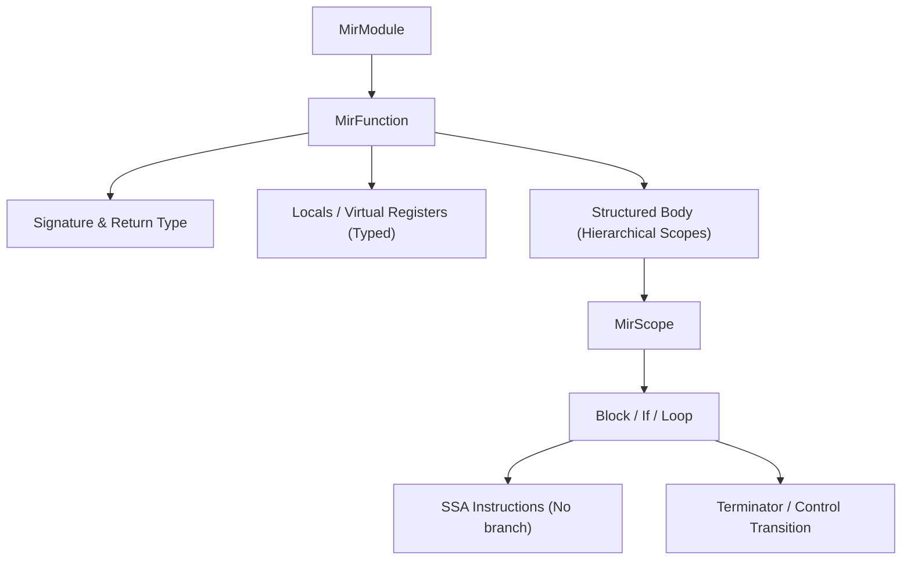

# Galfus MIR (Medium Intermediate Representation) Specification

This document defines the architecture, design, and key structures of the Galfus Medium Intermediate Representation (MIR), incorporating the architectural choices decided for the compiler pipeline.

---

## 1. Architectural Decisions

Based on the compiler requirements and design goals, the MIR is specified as:
1. **SSA (Static Single Assignment) with Block Parameters**: Every virtual register is assigned exactly once. Merging control flow uses block parameters (arguments passed to blocks) rather than traditional $\phi$ (phi) nodes, which simplifies liveness calculations.
2. **Structured Control Flow**: Instead of an entirely flattened Control Flow Graph (CFG) of raw jumps, the MIR retains hierarchical blocks (`Block`, `If`, `Loop`). This preserves lexical scope boundaries, making lifetime analysis for the Owner Graph direct and precise.
3. **Implicit Owner Graph Integration**: The MIR focuses on pure computation and generic `Drop(x)` statements where lifetimes end. The VM and the bytecode generator infer ownership graph updates (anchors, edges, weak links) using variable type metadata and allocation policies (e.g., local heap vs. shared thread memory).

---

## 2. Core Structure of MIR

The MIR of a module represents a translated `.gfs` file.



### 2.1 Virtual Registers (Locals)
All values (including parameters, local variables, and intermediate results) are stored in typed, immutable virtual registers (`LocalId`).
- Each local has a unique name/ID (e.g. `_0`, `_1`).
- Re-assignments in the source code are lowered to new virtual registers.

---

## 3. Structural Control Flow & Scope Definitions

Instead of raw basic blocks with arbitrary jumps, the MIR body is structured into nested execution scopes and structured blocks.

```rust
pub enum MirBody {
    /// A sequential list of instructions ending with a terminator
    BasicBlock(BasicBlock),
    /// A nested block of scopes with local bindings
    Block {
        locals: Vec<LocalDecl>,
        statements: Vec<MirBody>,
    },
    /// An if-else structure preserving scope
    If {
        cond: Operand,
        then_branch: Box<MirBody>,
        else_branch: Option<Box<MirBody>>,
    },
    /// A loop structure preserving loop scope
    Loop {
        body: Box<MirBody>,
    },
}
```

### 3.1 Block Parameters
To merge values at join points (such as the end of an `if-else` block returning a value), blocks can define parameters:
- A `Block` can accept values, which are bound to new SSA virtual registers when entering that block.

---

## 4. Key Data Forms

### 4.1 Operands & Constants
```rust
pub enum Operand {
    /// A literal constant (e.g. 10, true, "text", null)
    Constant(Constant),
    /// A virtual register
    Local(LocalId),
}
```

### 4.2 RValues (Right-Hand Side Expressions)
An `RValue` is a single computational step, always assigned to a virtual register.

```rust
pub enum RValue {
    /// Read an operand
    Use(Operand),
    /// Unary operator
    UnaryOp(UnaryOperatorKind, Operand),
    /// Binary operator
    BinaryOp(BinaryOperatorKind, Operand, Operand),
    /// Cast to another type
    Cast(Operand, Type),
    
    /// Instantiate structures (with metadata parameters like allocation space)
    NewStruct {
        type_id: StructTypeId,
        fields: Vec<Operand>,
        /// Metadata describing the storage class (e.g. thread-shared vs thread-local)
        storage_meta: StorageMetadata,
    },
    NewArray(ArrayTypeId, Vec<Operand>),
    NewTuple(TupleTypeId, Vec<Operand>),
    
    /// Read field or index
    MemberAccess(Operand, MemberField),
    /// Construct choice variant
    Choice(ChoiceVariantId, Option<Operand>),
    /// Dynamic type/variant check
    Instanceof(Operand, Type),
}
```

### 4.3 Instructions & Terminators
An instruction is non-branching:
```rust
pub enum Instruction {
    /// Assign the result of an RValue to an SSA register
    Assign(LocalId, RValue),
    /// Explicitly end the lifetime of an SSA register (triggers drop in the VM)
    Drop(LocalId),
}
```

A terminator completes a sequence of instructions within a structured block:
```rust
pub enum Terminator {
    /// Return from the current function
    Return(Option<Operand>),
    /// Exit a loop or block
    Break,
    /// Jump to the next iteration of a loop
    Continue,
    /// Call a function/method
    Call {
        func: FunctionId,
        args: Vec<Operand>,
        destination: LocalId,
    },
    /// Abort execution with a message
    Panic(String),
}
```

---

## 5. Implicit Memory & Ownership (Owner Graph)

The Owner Graph is managed implicitly by the VM and the bytecode generator using **Type Metadata** and **Life Boundaries**:
1. **Allocation Metadata**: Instructions like `NewStruct` hold metadata (`StorageMetadata`) telling the VM whether to allocate on the thread-local heap, stack, or shared concurrent heap.
2. **Deterministic Drops**: The compiler inserts `Drop(local)` at the exact point in the MIR where the local variable's virtual register is no longer alive (computed via SSA liveness analysis).
3. **VM Execution**: The VM interprets `Drop(local)` and implicitly:
   - Breaks any outgoing ownership edges (`edges`).
   - If the target loses all incoming ownership connections (`anchors`), the VM triggers the destruction schedule.
   - Cleans up weak links (`weak`).
